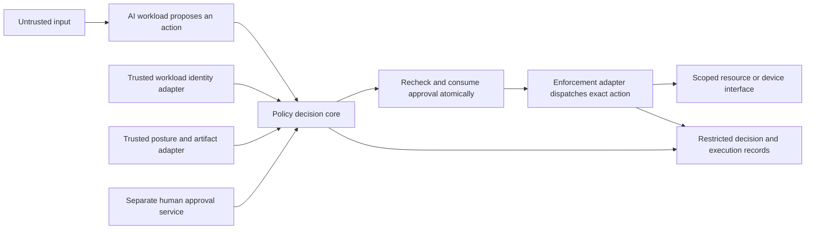

# AI security foundation

Internal development scope, October 6, 2026. The app and console remain closed.
This builds on Vraelis's existing defense, infrastructure and robotics direction.

## Product purpose

Help engineering and security teams control and investigate AI-enabled systems:
what an AI workload may access, which actions it may propose, what software and
model versions are involved, and whether observed behavior follows the approved
security policy. A future live integration must enforce the policy at the actual
tool, data, deployment or command boundary.

This is a broader direction than ordinary web QA or task-recording review.
Recording review can supply evidence, but a log viewer alone does not prevent
unauthorized actions. Public pages should reflect implemented capabilities and
clearly separate development areas.

## Problem map

| Problem | Relevant control | Current implementation |
| --- | --- | --- |
| A workload reaches a resource outside its authority | Exact identity, environment, resource and action grants; deny by default | Private policy core; no live credential or enforcement adapter |
| An AI changes an action after approval | Exact proposal/policy digests, expiry, separate human approval | Private policy core; no approval UI, signature validation or atomic execution store |
| A model artifact changes without review | Trusted artifact verification and pinned model digest | Private policy core checks adapter-supplied evidence; no artifact verifier |
| An injected instruction triggers an unauthorized tool call | Independent policy checks after proposal generation and before execution | Policy core can reject an out-of-scope proposal; injection detection and live interception are not built |
| Reports conflict or evidence is absent | Deterministic source-event review and capture qualifications | Existing normalized JSON and narrow MCAP recording evaluator |
| Model, dataset or dependency supply chain is compromised | Reviewed artifact provenance, signatures, inventories and controlled deployment | Research/integration work; a supplied digest alone does not authenticate an artifact |
| Adversarial sensor inputs mislead a perception model | Model-specific evaluation, representative test data and separate trusted observations | Research; no native perception/sensor testing |
| Behavior changes over time | Version-bound monitoring, qualified baselines and incident investigation | Recorded comparisons exist; continuous collection and security analytics are not integrated |

The pasted research is not verification of market figures, competitive gaps or
legal requirements. Review authoritative sources before publishing those claims.

## Implemented policy core

`lib/ai-security/policy.ts` accepts three separate inputs:

1. An administrator-owned versioned policy with exact grants and freshness limits.
2. An untrusted structured proposal with a request ID, principal/session, target
   environment/resource, action, model digest and exact payload digest.
3. Context assembled by trusted identity, posture and approval adapters, including
   the trusted evaluation clock. The current test harness supplies synthetic context.

Every evaluation returns `permit` or `deny`, individual check results, and the
proposal/policy digests that bind the decision. Additional proposal fields cannot
inject privileges. Invalid schemas, unknown scope, wildcard grants, ambiguous
rules, unknown health, stale observations, mismatched artifacts and missing
identity fail closed. All export, model-deployment and device-command grants
require a separate human approval for this exact proposal and policy.

The library verifies policy conditions on supplied context. It does not verify
credentials, signatures or physical observations. A client may never submit its
own “trusted” context to a future public endpoint. Strict parsing does not make
input authentic. A digest establishes byte binding, not producer authenticity.

## Required enforcement architecture

Only the policy core is newly implemented here. The diagram describes the
integration to build. It is not a claim that a deployed security gateway exists.

Choose an owned test environment for the first live adapter. The adapter must
derive identity and attestation from trusted verifiers, compute the payload digest
from the exact canonical action bytes, and obtain policy from an administrator
store. Treat targets, arguments and tool selection as part of those bytes.
The adapter owns the action-to-operation mapping: an AI-supplied
`telemetry.read` label must never route to a mutating operation. Resource IDs
must resolve through an owned registry rather than caller-supplied endpoints.

Re-evaluate immediately before dispatch. Check the current policy and revocation
state; atomically consume an approval so concurrent requests cannot both execute.
Prevent access to the underlying resource through another route. A previously
returned permit is not a reusable token. Test that changed arguments, sessions,
model versions, policy content and resources require a new decision.

Design outage behavior with the system owner. Denying a new AI proposal must not
silently disable an independent safety controller or create a physical hazard.
No hardware command path is implemented in this foundation.

## Audit and feedback

Retain necessary identities, policy/model/configuration versions, decision codes
and approved action bindings with restricted access and retention rules. Add
execution outcomes when an adapter exists. Do not collect raw secrets or assume
that a generated model explanation proves causal reasoning. Do not describe a
plain JSON record or SHA-256 digest as an immutable audit store.

Feedback can identify new attack cases and propose revised policies or models.
Changes require review, a test environment, version binding and rollback. The
research document's recurrent learning loop does not authorize unattended model
changes in a deployed defense or infrastructure system.

## Verification and next integration milestone

Run `npm run ai:security:test`. The synthetic suite covers
cross-resource access, environment changes, identity and posture freshness,
revocation, model changes, approval substitution, reuse, policy/payload mutation,
injected privileges and invalid inputs. It validates these policy rules; it does
not measure attack-detection accuracy or prove production security.

The next milestone is one test-only tool boundary with authenticated context,
administrator-owned policy, atomic approval consumption and a retained execution
record. Acceptance: an allowed action succeeds once; a malicious or changed
proposal is denied before dispatch; a reviewer can trace the exact decision and
observed outcome. Select real model/sensor and supply-chain integrations from
the system being secured rather than promise universal attack coverage.
